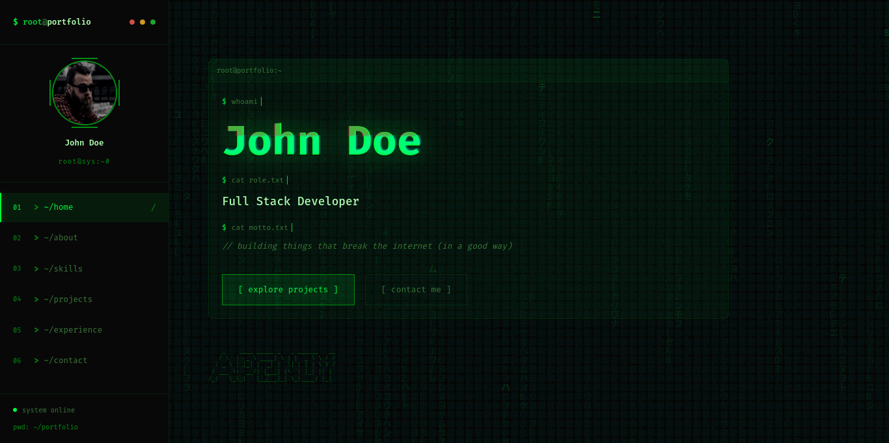

# Portfolio — Terminal/Hacker Theme

A developer portfolio website with a hacker/terminal aesthetic, featuring Matrix rain animation, glitch effects, boot screen, and a fully responsive sidebar navigation.



## Tech Stack

- [Astro](https://astro.build) — Static site generator
- [React](https://react.dev) — UI components
- [react-icons](https://react-icons.github.io/react-icons/) — Icon library
- Vanilla CSS with custom properties (no framework)

## Features

- **Matrix Rain** — Canvas-based falling characters background animation
- **Boot Screen** — Terminal-style system initialization sequence on load
- **Glitch Text** — CSS-driven glitch effect on the hero heading
- **Typing Animation** — Terminal commands animate as if being typed
- **Scroll Reveal** — Elements fade/slide in on scroll via IntersectionObserver
- **Count-up Stats** — Animated number counters in the About section
- **Sidebar Navigation** — Fixed sidebar with active section tracking and mobile hamburger toggle
- **Avatar Effects** — Glitch, scanline, hex overlay, and pulse ring on hover
- **Contact Form** — Terminal-styled form with labeled inputs
- **Responsive** — Adapts from desktop sidebar to mobile overlay menu

## Project Structure

```text
/
├── public/
│   ├── avatar.jpg
│   ├── favicon.svg
│   └── readme-docs.png
├── src/
│   ├── assets/
│   │   ├── astro.svg
│   │   └── background.svg
│   ├── components/
│   │   ├── ContactIcon.tsx      # GitHub, LinkedIn, Twitter, Email icons
│   │   ├── MatrixRain.astro     # Canvas matrix rain background
│   │   ├── ProjectIcon.tsx      # Bolt, Lock, Chart, Globe icons
│   │   ├── Sidebar.astro        # Fixed sidebar with nav + profile
│   │   └── Welcome.astro        # Default Astro welcome (unused)
│   ├── layouts/
│   │   └── Layout.astro         # HTML shell + global CSS variables
│   └── pages/
│       └── index.astro          # Main page with all 6 sections
├── astro.config.mjs
├── package.json
├── tsconfig.json
└── README.md
```

## Sections

| # | Section      | Description                                  |
|---|--------------|----------------------------------------------|
| 01 | Home         | Hero with terminal-style intro + ASCII art   |
| 02 | About        | Bio text + animated stat cards               |
| 03 | Skills       | Categorized tech stack tags (4 categories)   |
| 04 | Projects     | 4 project cards with icons + tech tags       |
| 05 | Experience   | Timeline of work history                     |
| 06 | Contact      | Terminal-styled form + social links           |

## Getting Started

### Prerequisites

- Node.js >= 22.12.0
- pnpm

### Install & Run

```sh
pnpm install
pnpm dev
```

Open [http://localhost:4321](http://localhost:4321) in your browser.

### Other Commands

| Command          | Action                                   |
| :--------------- | :--------------------------------------- |
| `pnpm build`     | Build production site to `./dist/`       |
| `pnpm preview`   | Preview the production build locally     |
| `pnpm astro ...` | Run Astro CLI commands                   |

## Customization

- **Colors** — Edit CSS custom properties in `src/layouts/Layout.astro` (`:root` block)
- **Content** — Modify text, projects, skills, and experience directly in `src/pages/index.astro`
- **Avatar** — Replace `public/avatar.jpg` with your own photo
- **Sections** — Add or remove sections in `index.astro` and update the sidebar nav array in `Sidebar.astro`

## License

MIT
